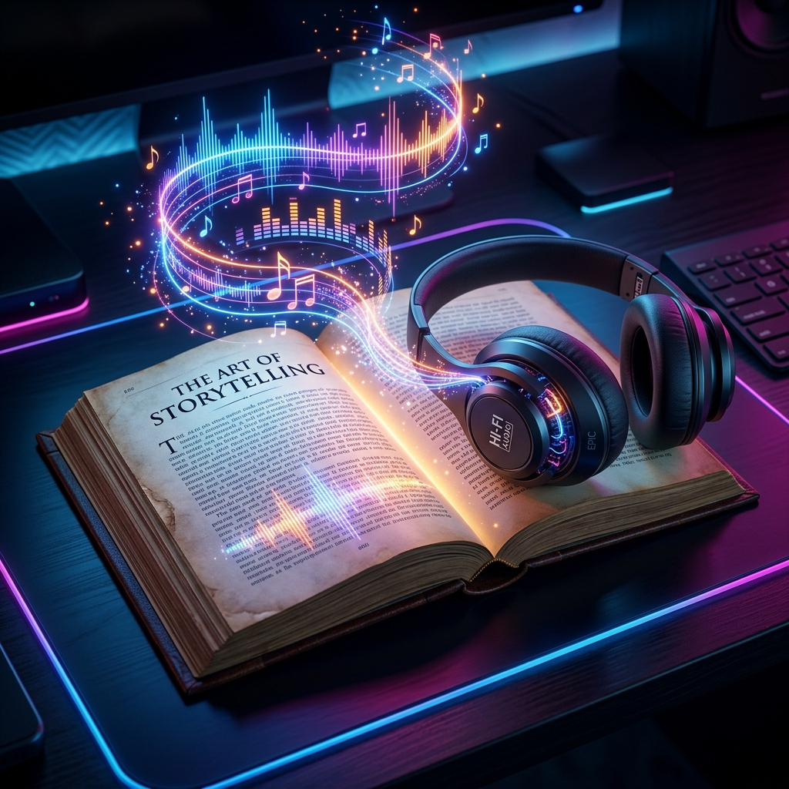

<div align="center">
  
</div>

# 🍌 StoryTeller: The Cinematic Audiobook Engine
**Turning raw stories into full-scale cinematic audio experiences.**

## 📖 The Vision
Imagine if every story you ever wrote didn't just stay on a page, but came alive precisely the way you imagined it. **StoryTeller** was built with a single goal: to completely automate the production of breathtaking, high-fidelity audiobooks. 

With zero human intervention, StoryTeller reads your raw text, acts as the director, analyzes the tone, casts the voice actors, composes the background score, and masterfully mixes it all together into a final, cinematic MP3 file. Don't just read your story. *Experience it.*

---

## 🛠 The Tech Stack
StoryTeller is a highly robust, distributed backend architecture designed to orchestrate heavy AI pipelines in perfect sequence:

- **Framework**: FastAPI (Python 3.11)
- **Database**: PostgreSQL (with SQLAlchemy ORM & Alembic)
- **Message Broker**: Redis
- **Task Orchestration**: Celery
- **LLM Intelligence**: Google Gemini API (Scene Parsing & AI Direction)
- **Voice Synthesis**: ElevenLabs API (with gTTS fallback)
- **Background Scoring**: Meta MusicGen 
- **Audio Mixdown**: PyDub
- **Infrastructure**: Docker & Docker-Compose

---

## 🚀 How it Works
When a book chapter is dropped into the engine, the magic happens in four highly-distributed phases:

1. **The Director (Scene Parsing)**: Gemini reads the text, extracts the emotional undertones, flags character dialogue, and splits the chapter into dramatic scenes.
2. **The Voice (Narration)**: The engine passes the raw text into premium TTS services to generate ultra-realistic, human-like narration.
3. **The Score (Music Generation)**: StoryTeller automatically designs a custom prompt for the background track and generates an instrumental score that perfectly matches the mood of the scene.
4. **The Mixdown (Cinematic Stitching)**: PyDub dynamically layers the tracks, ducks the background music when characters are speaking, adds crossfades, and stitches the scenes together into a flawless final audiobook.

---

## 💻 Quick Start

### 1. Requirements
- Python 3.11+
- Docker
- API Keys for Google Gemini & ElevenLabs

### 2. Installation
```bash
git clone https://github.com/your-username/story-teller.git
cd story-teller/audiobook-engine
python -m venv venv
source venv/bin/activate
pip install -r requirements.txt
```

*(Rename `.env.example` to `.env` and securely paste your API keys!)*

### 3. Spin Up the Engine
Because this is a multi-service pipeline, you need **3 separate terminal tabs**:

**Tab 1 (Database & Broker):**
```bash
cd story-teller
docker compose up redis postgres -d
```

**Tab 2 (The Gateway API):**
```bash
cd story-teller/audiobook-engine
source venv/bin/activate
export PYTHONPATH=$PYTHONPATH:.
uvicorn api.main:app --reload --port 8000
```

**Tab 3 (The Producer Worker):**
```bash
cd story-teller/audiobook-engine
source venv/bin/activate
celery -A workers.celery_app worker --loglevel=info --pool=solo
```

### 4. Direct your Masterpiece!
Trigger the engine by submitting a text file to the API:
```bash
curl -X POST http://localhost:8000/jobs/ \
  -H "Content-Type: application/json" \
  -d '{"book_title": "The Veiled Lodger", "file_id": "80dcd21c-eda5"}'
```
Watch the orchestration spin up as the database tracks the job state in real-time. Once the worker finishes the background score mixdown, grab your headphones, open the `audio_files/final/` directory, and listen to your story come alive!

---
*Engineered with ❤️ by Nano Banana Microsystems*
